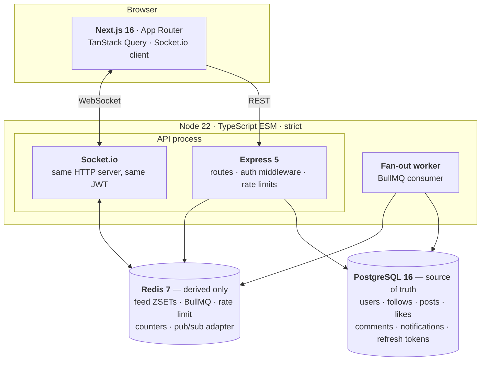
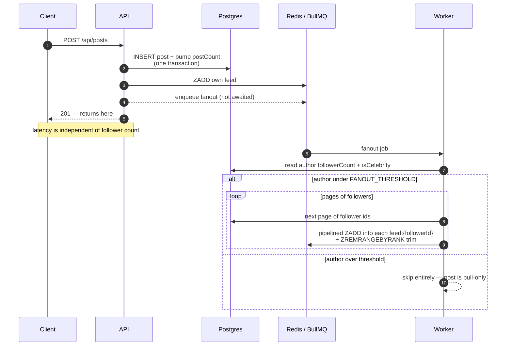
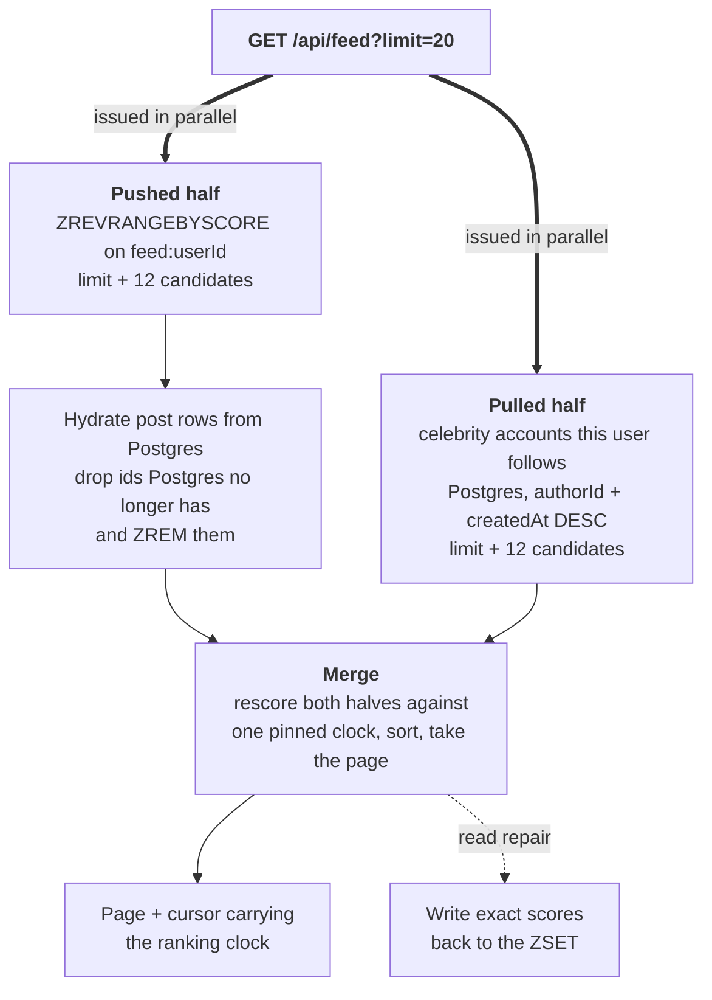
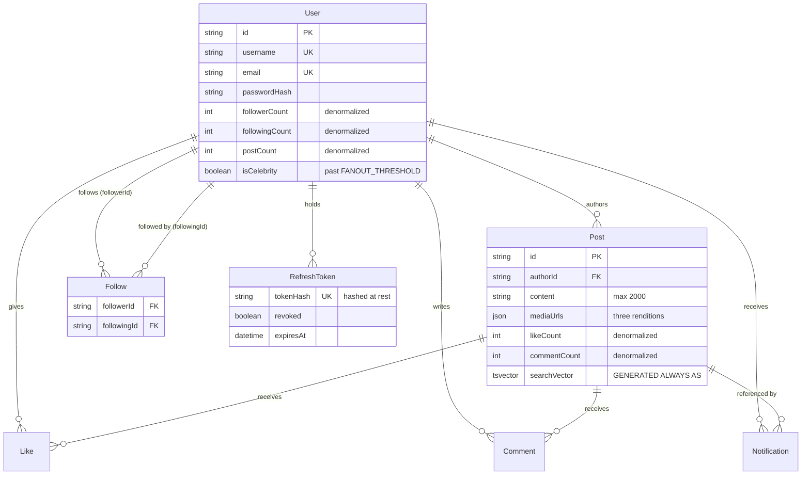

# Architecture

This document explains why Pulse is built the way it is. The [README](README.md) covers what it
does and what it measures; this one covers the reasoning, the alternatives that were rejected, and
where everything lives.

- [The problem](#the-problem)
- [System view](#system-view)
- [The write path](#the-write-path)
- [The read path](#the-read-path)
- [Ranking](#ranking)
- [Data model](#data-model)
- [The Redis key space](#the-redis-key-space)
- [Real-time](#real-time)
- [Search](#search)
- [Media](#media)
- [Project structure](#project-structure)
- [Decisions, restated](#decisions-restated)
- [Known limits](#known-limits)

---

## The problem

A personalized timeline is a query with no good answer at scale:

```sql
SELECT * FROM posts
WHERE author_id IN (everyone I follow)
ORDER BY <something>
LIMIT 20
```

If `<something>` is `created_at`, Postgres does fine. A `[authorId, createdAt DESC]` index turns it
into one index descent per followed author, merged, stopping after 20 rows. **The README measures
this at 44 ms p50 and it beats every cache in the project.** If a chronological timeline is all you
need, stop here and build that.

The moment `<something>` is a *ranking* — engagement, decayed by age — that plan dies. The sort key
is computed, not stored, so no index can serve the `ORDER BY`. Every candidate post from every
followed author has to be read and scored before the top 20 is known. The work now grows with how
much your network posted, not with how much you are about to look at:

| posts in the corpus | ranked, computed per request |
|---|---|
| 50,000 | 98 ms |
| 300,000 | 635 ms |

That 6.5× is the thing this architecture exists to remove. Everything below follows from it.

---

## System view



The worker is drawn separately because it deploys separately. `INLINE_WORKER=true` runs it inside
the API process so local dev needs one terminal; `false` makes it its own process, which is how it
ships. Nothing in the code knows the difference — it is the same consumer either way.

**The invariant that makes this safe: Postgres is the only thing that has to be right.** Everything
in Redis is derived and rebuildable. Feeds carry a 30-day TTL and rebuild from Postgres on the next
read. Rate limiting fails open if Redis is unreachable. Losing Redis entirely costs latency and a
few minutes of queued fan-out — never data.

The one exception worth naming: **the BullMQ queue is in Redis, and a dropped job is a post that
silently reaches nobody.** That is why the deploy config sets `maxmemoryPolicy: noeviction`. The
feed ZSETs would survive eviction; the queue would not.

---

## The write path



**Why the response does not wait.** An account with 2,444 followers generates 73,320 Redis writes
per post. Doing that inline would tie post latency to follower count, which is exactly the property
that makes fan-out-on-write collapse for large accounts. Measured: post latency stays at **50 ms
p50** while the worker sustains **43,556 follower-feed writes/sec** behind it.

**Why the author's own feed is written inline.** Everything else can be eventually consistent, but
you seeing your own post is not negotiable — a user who posts and does not immediately see it
assumes it failed. One `ZADD` is cheap enough to pay for on the request path.

**Why `enqueue` is never awaited.** The Postgres transaction has already committed. If enqueuing
fails, the write is still valid and the feed can be rebuilt; failing the HTTP request at that point
would report a lie to the client. The failure is logged, not propagated.

**Why the threshold check reads a stored counter.** `followerCount` is denormalized precisely so
this decision costs nothing. A `COUNT(*)` on the follow table per post would put the most expensive
possible query on the hottest path. This is also why counters are updated in the same transaction as
the row that changes them — a drifting counter does not just display wrong, it silently misroutes
fan-out.

---

## The read path



**Why `limit + 12` from each half and not a multiple.** The top *k* of a merged list is always a
subset of (top *k* of A) ∪ (top *k* of B). Taking *k* from each half is already mathematically
sufficient — the +12 only covers posts deleted since fan-out and small score drift. An earlier
version over-fetched 3× and that was pure waste; fixing it, along with running the two halves in
parallel instead of sequentially, cut cold reads from 203 ms to 103 ms.

**Why the cursor carries a clock.** Scores decay continuously, so the score of a given post is lower
on the request for page 2 than it was for page 1. A plain score cursor therefore drifts *into* the
posts it already served, and page 2 repeats page 1's last item. Pinning the ranking clock in the
cursor makes every page of one pagination run score against the same instant.

**Why a global celebrity cache, not per user.** The natural cache is "the celebrity accounts *this
user* follows". It is also wrong: the moment an account crosses the threshold, every existing
follower's cached list is stale, and that account's posts are no longer being pushed to them either.
Not pushed, not yet pulled — the posts reach nobody until the cache expires. One global set of
celebrity ids, invalidated with a single `DEL` on promotion, has no such window. It stays small
because crossing the threshold is rare.

**Why dangling ids are dropped on read.** A deleted post leaves its id in every ZSET it was fanned
out to. Chasing those down at delete time is a second fan-out; letting the read path skip ids
Postgres no longer has, and `ZREM` them as it goes, is self-healing and costs nothing extra — the
hydration query already tells you which ids came back.

---

## Ranking

```
score = (1 + likes + 2·comments) / (age_hours + 2)^1.8
```

Three properties are doing real work here.

**The numerator is linear in engagement.** At a fixed age, one more like is always worth exactly
`1 / (age + 2)^1.8`, regardless of how many likes the post already has. That is what makes
incremental updates possible: a like applies to every cached copy of that post with a single
`ZADD ... XX INCR` per feed. No recompute, no re-sort, no read-modify-write.

**`XX` is not optional.** Without it, `INCR` *creates* the member if it is missing — inserting the
post into the feeds of users it was never fanned out to. The flag is what makes "apply this delta
wherever the post already is" mean what it says.

**The `+2` in the denominator** keeps a brand-new post from dividing by something near zero, which
would give the newest post an unbeatable score for its first minutes.

Decay is handled twice, deliberately:

- **Read repair** — the read path already computes exact scores for the page it serves, so it writes
  them back. Feeds people actually look at stay accurate for free.
- **A periodic job** — refreshes feeds read in the last hour, tracked in a `feeds:active` ZSET. The
  work is bounded by active users, not registered ones. Someone who has not signed in for a month
  costs nothing, and their feed rebuilds on demand when they return.

---

## Data model



**Denormalized counters.** `likeCount`, `commentCount`, `followerCount`, `followingCount` and
`postCount` are all stored, and all updated in the same transaction as the row that changes them.
This is not an optimization for display — it is what lets the fan-out decision and the ranking delta
run without aggregate queries. The cost is that a counter and its rows can disagree if you write
around the API; the transaction boundary is what prevents that from happening through it.

**`searchVector` is a generated column.** Postgres maintains it from `content`, so it cannot drift.
Prisma has no representation for `tsvector`, so it is `Unsupported(...)` in the schema and the
`GENERATED ALWAYS AS` clause lives in a hand-edited migration. Regenerating that migration locally
is what would lose the edit — applying it with `migrate deploy` never touches it.

**Refresh tokens are rows, not JWTs.** An opaque random string, hashed at rest, single-use, rotated
on every refresh. That buys server-side revocation, which a stateless JWT cannot have. Replaying a
used token is treated as theft and revokes every session for that user.

---

## The Redis key space

Every key the feed system touches is declared in one file, `feed/keys.ts`, so the whole surface is
auditable at a glance.

| Key | Type | Holds | Lifetime |
|---|---|---|---|
| `feed:{userId}` | ZSET | post ids scored by hot score | 30-day TTL, capped at `FEED_MAX_LENGTH` |
| `celebrities:ids` | SET | every account past the threshold | 60 s TTL, `DEL` on promotion |
| `feeds:active` | ZSET | user ids scored by last feed read | trimmed by the decay job |
| `rl:*` | counters | rate limit windows | window TTL |
| BullMQ internals | mixed | the `feed` queue | bounded job history |

Two caps keep memory proportional to *active* users rather than registered ones: the per-feed length
cap and the per-feed TTL. Neither loses anything — both rebuild from Postgres on the next read.

---

## Real-time

Socket.io shares the Express HTTP server and authenticates with the same JWT, passed in the
handshake because a browser cannot set an `Authorization` header on a WebSocket upgrade.

- Every client joins `user:{id}` on connect → `notification:new` on like, comment, follow.
- Clients join `post:{id}` only while that post is on screen → `post:like_update`,
  `post:comment_update`. Subscribing to only what is visible is what keeps the fan-out of events
  bounded on a long feed.

**Events are emitted only after the transaction commits**, never inside it. An emit inside a
transaction that later rolls back announces a write that never happened, and there is no way to
retract it.

**The Redis adapter is wired in from the start.** Without it, two API instances each broadcast only
to their own connected sockets, and real-time silently half-works the moment you scale past one
process — the worst kind of bug, because nothing errors.

There is no polling anywhere in the client.

---

## Search

Both endpoints are one indexed Postgres query. No Elasticsearch: a second datastore to run, sync,
and keep consistent is a real operational cost, and Postgres answers this workload well enough to
make that cost unjustifiable at this scale.

- **Posts** — GIN index on the generated `tsvector`, queried with `websearch_to_tsquery`, which
  accepts what people actually type (quoted phrases, `OR`, leading `-`) instead of erroring on a
  stray character.
- **Users** — `pg_trgm` GIN indexes on username and display name, so `nva` still finds `nova`.
  Exact prefix matches rank first, then trigram similarity, then follower count.

The measured honesty, via `GET /api/search/explain?q=`: a selective query (98 rows) uses the GIN
index and answers in 5.7 ms; a term matching ~24,000 rows gets a parallel sequential scan and takes
76 ms. The planner is right both times — `ORDER BY ts_rank(...)` has to score every match, so past
roughly 8% of the table a scan genuinely wins. The index is what makes selective queries fast, and
selective queries are what search traffic mostly is.

---

## Media

`POST /api/media/upload` → Multer (memory, 5 MB cap) → Sharp → three WebP renditions: `thumb`
(200×200), `feed` (600px), `original` (capped at 1600px). The feed card loads the 600px rendition,
so a timeline never downloads full-size images. Re-encoding to WebP strips EXIF, including GPS, as a
side effect.

Storage sits behind a one-method interface with two implementations — local disk by default, so the
project runs with no cloud account, or any S3-compatible bucket with `STORAGE=s3`. The S3 SDK is
imported lazily and is not a dependency; install it only if you use it.

---

## Project structure

```
apps/api
  prisma/schema.prisma      users, follows, posts, likes, comments, notifications
  prisma/seed.ts            8-user demo dataset
  prisma/seed-load.ts       Zipfian load-testing dataset

  src/index.ts              API entrypoint
  src/worker.ts             standalone worker entrypoint (INLINE_WORKER=false)
  src/app.ts                Express wiring, health probe
  src/env.ts                parsed, validated environment

  src/auth/                 JWT access tokens, refresh rotation, middleware
  src/users/                profiles, follow graph, follower lists
  src/posts/                posts, likes, comments
  src/notifications/        list, unread count, mark read
  src/search/               tsvector + pg_trgm queries, EXPLAIN endpoint
  src/media/                upload pipeline, storage adapter
  src/realtime/             Socket.io server, emit helpers
  src/middleware/           error handling, rate limiting
  src/lib/                  prisma, redis, logger, HttpError, serialization

  src/feed/                 ← the centrepiece
    keys.ts                 every Redis key, in one place
    score.ts                the ranking formula and its incremental delta
    store.ts                every Redis feed operation, nothing else touches these keys
    read.ts                 hybrid read, rebuild, and both baselines
    processors.ts           fanout, engagement, backfill, cleanup, decay jobs
    queue.ts                BullMQ queue, job payload types, scheduler
    worker.ts               the consumer
    routes.ts               GET /api/feed, /status, /rebuild

  tests/core.mjs            auth, follow graph, posts, both feed paths
  tests/features.mjs        media, Socket.io, search, rate limiting

apps/web
  app/globals.css           design tokens plus card, button and input shapes
  app/page.tsx              feed (or the signed-out landing page)
  app/login/  app/register/ app/search/
  app/u/[username]/         profile — server-rendered, public, crawlable
  app/p/[id]/               single post, linked from notifications

  components/               Composer, FeedList, PostCard, NotificationBell,
                            FollowButton, Nav, Avatar, Skeleton, PasswordInput
  components/icons.tsx      inline SVG, no icon library
  lib/api.ts                fetch wrapper, token refresh, single-flight retry
  lib/socket.ts             one shared socket, room subscriptions
  lib/auth.tsx              session context
  lib/types.ts              shared DTOs and display formatters

loadtest/
  bench.mjs                 three-way feed comparison, no dependencies
  fanout-bench.mjs          worker throughput
  feed.k6.js                k6 version with ramping VUs
```

**Why `feed/` is split into six files rather than one.** Each has a single reason to change:
`score.ts` is the formula, `keys.ts` is the key space, `store.ts` is the only module that issues
Redis feed commands, `read.ts` is the read path, `processors.ts` is the write path, `queue.ts` is the
transport. The important one is `store.ts` — routing every feed mutation through one module is what
makes an invariant like "always `ZADD XX INCR`, never `ZINCRBY`" enforceable by reading a single
file instead of grepping the repo.

**Why the API is grouped by feature and not by layer.** There is no `controllers/`, `services/`,
`repositories/` triple. A change to how likes work touches `posts/routes.ts` and nothing else;
splitting by layer would spread it across three directories to no benefit at this size. `lib/` holds
only things genuinely shared by every feature.

**Why the profile page is server-rendered and the feed is not.** Profiles are public and have no
per-viewer state in their shell, so they can be crawled and shared — which is the reason the
frontend is Next.js at all rather than a client-only SPA. The feed is per-viewer, authenticated, and
behind a token held in memory; server-rendering it would buy nothing and leak it into the HTML.

---

## Decisions, restated

| Decision | Alternative | Why this one |
|---|---|---|
| Hybrid push/pull fan-out | Pure push, or pure pull | Push alone collapses on high-follower accounts; pull alone collapses on users who follow many people |
| Ranked feed cached in Redis | Rank per request | Per-request ranking scales with corpus size, 6.5× worse at 6× the posts; the cache stays flat |
| Redis ZSET as the feed | Materialized table in Postgres | The feed is a sorted set with an incremental score update — that is literally the ZSET data type |
| Global celebrity id set | Per-user "celebrities I follow" | Per-user goes stale on promotion, and those posts then reach nobody |
| Denormalized counters | `COUNT(*)` on demand | The push-vs-pull decision reads `followerCount` on the hottest path |
| Postgres full-text search | Elasticsearch | A second datastore to run and keep in sync, for a workload one GIN index answers in 5.7 ms |
| Opaque, hashed, rotating refresh tokens | Long-lived JWT | Server-side revocation, and replay detection that a stateless token cannot have |
| Access token in memory | `localStorage` | An XSS cannot read back what was never persisted |
| Rate limiting fails open | Fails closed | A guard rail should not take the API down when its own dependency is unreachable |
| Prisma, raw SQL by exception | Raw SQL throughout | Four places genuinely need it (`ts_rank`, the ranking `ORDER BY`, bulk seed operations, the health probe); everywhere else loses type safety for nothing |

---

## Known limits

Deliberate, and listed so they are not mistaken for oversights.

- **Deep pagination is approximate.** Scores move while you paginate, so a post can shift across a
  page boundary. The real fix is snapshotting the ranked page per session.
- **There is no celebrity demotion.** Posts written while an account was flagged were never pushed
  to anyone, so clearing the flag would silently hide them from feeds that never received them.
- **Unfollow removes the author's 60 most recent posts** from your feed; older ones age out of the
  capped ZSET on their own rather than being hunted down.
- **One API instance, unless you add sticky sessions.** Socket.io opens with an HTTP handshake before
  upgrading, and that handshake must land on the instance that will hold the socket. The Redis
  adapter solves cross-instance *broadcast*, not this.
- **`ranked-live` only scores the last 7 days.** Without a bound, the baseline's scan grows without
  limit and stops being a useful comparison. On a dataset with nothing recent, that mode returns an
  empty page while the other two do not.
- **`FANOUT_THRESHOLD` must match the data.** If a seed flagged celebrities at a different number,
  the API and the dataset disagree about who is on the pull path.

Out of scope by choice: DMs, stories, video, a mobile app, read replicas.
