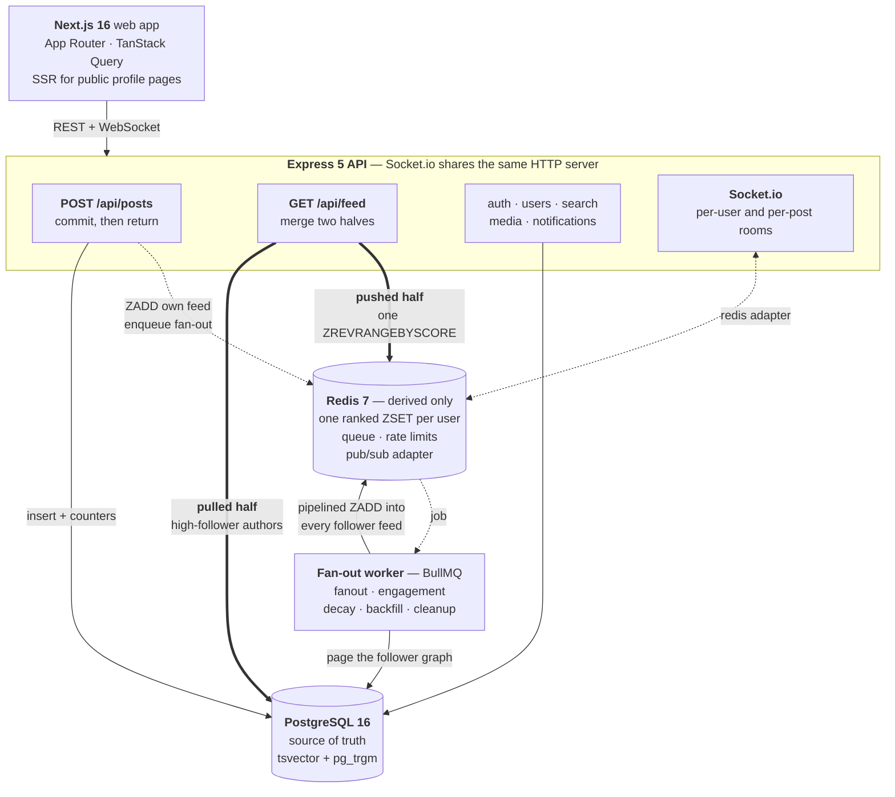

# Pulse

A follower-graph social feed built around one problem: **generating a personalized, *ranked*
timeline without recomputing it on every read.**

Posts are fanned out to follower feeds in Redis on write. Accounts past a follower threshold are
never fanned out — their posts are pulled from Postgres at read time and merged in. Both halves
are ranked by a decaying engagement score that updates incrementally instead of being recomputed.

Three ways of building the same page are implemented side by side and reachable at
`GET /api/feed?mode=`, so the design can be measured instead of argued about.

---

## Measured results

Numbers from `node loadtest/bench.mjs` on a local Docker Postgres + Redis, single API process,
**5,000 users · 633,422 follows · 300,000 posts · 400,000 likes**, Zipfian follower distribution
(22 accounts over the 2,500-follower pull threshold). 300 requests per path, concurrency 15.

| feed path | p50 | p95 | req/s | server p50 | server p95 |
|---|---|---|---|---|---|
| hybrid, cold cache | 197.8 ms | 235.7 ms | 74 | 178.8 ms | 226.1 ms |
| **hybrid, warm cache** | **73.8 ms** | **92.1 ms** | **197** | **57.5 ms** | **73.9 ms** |
| ranked, no cache | 635.5 ms | 1034.9 ms | 23 | 630.7 ms | 1026.3 ms |
| chronological join | 44.3 ms | 49.5 ms | 337 | 29.6 ms | 34.9 ms |

Against the row that produces **the same ranked output**: **8.6× faster at p50, 11.2× at p95,
8.7× the throughput.**

The reason is in how each one scales. Six times the posts, same everything else:

| posts | ranked, no cache (p50) | hybrid warm (p50) |
|---|---|---|
| 50,000 | 98 ms | 81 ms |
| 300,000 | 635 ms | **74 ms** |

The uncached ranking got 6.5× slower; the cached path did not move. That is the whole argument:
ranking by a decaying score means reading, scoring, and sorting every candidate post before you
know the top 20, so the work grows with how much your network posted. Reading a pre-ranked ZSET
is proportional to the page you asked for.

**Fan-out throughput** (`node loadtest/fanout-bench.mjs`) — 30 posts by an account with 2,444
followers, so 73,320 follower-feed writes:

| | |
|---|---|
| `POST /api/posts` p50 | 50.3 ms |
| all writes accepted | 1,591 ms |
| queue fully drained | 1,683 ms |
| follower-feed writes/sec | **43,556** |

Post latency does not depend on follower count — the request returns when Postgres commits, and
the 73,320 Redis writes happen on the queue afterwards.

### The honest part

**A plain chronological join beats all of this**, and by a lot (44 ms vs 74 ms), at any dataset
size I tested. With a `[authorId, createdAt DESC]` index, Postgres answers it as one index
descent per followed author and stops after 20 rows. If a time-ordered timeline is all you need,
a feed cache is overhead and you should not build one.

The cache earns its place only because the feed is *ranked*. That is the comparison in the table,
and it is the one worth defending.

I also measured this wrong the first time. My initial baseline was the chronological query, which
made the hybrid path look 2× *slower* — true, and meaningless, because the two were producing
different pages. Fixing the comparison is what produced the 8.6× number, and fixing two real
inefficiencies it exposed (over-fetching 3× more candidates than the merge needs, and awaiting
two independent lookups in sequence) cut cold reads from 203 ms to 103 ms.

---

## Quick start

```bash
npm install
docker compose up -d                 # postgres + redis
cp apps/api/.env.example apps/api/.env
cp apps/web/.env.example apps/web/.env.local

npm run db:migrate                   # schema
npm run db:seed -w @pulse/api        # 8 users, a follow graph, some posts

npm run dev:api                      # http://localhost:4000
npm run dev:web                      # http://localhost:3000
```

Sign in as any seeded user (`nova`, `kai`, `juno`, `rex`, `iris`, `milo`, `sage`, `wren`) with
password `password123`.

`INLINE_WORKER=true` in `apps/api/.env` runs the fan-out worker inside the API process so dev
needs one terminal. Set it to `false` and run `npm run dev:worker` to run it the way it deploys.

### Tests

```bash
npm run test -w @pulse/api           # 96 assertions against a running API
```

`tests/core.mjs` covers auth, the follow graph, posts, and both feed paths. `tests/features.mjs`
covers the media pipeline, Socket.io, search, and rate limiting.

### Load testing

```bash
npm run db:seed:load -w @pulse/api -- --follows 150 --threshold 2500 --posts 300000
# set FANOUT_THRESHOLD=2500 in apps/api/.env to match, then:
RATE_LIMIT_MULTIPLIER=1000 npm run dev:api

node loadtest/bench.mjs
node loadtest/fanout-bench.mjs
k6 run loadtest/feed.k6.js           # if you have k6
```

The multiplier is there because a load test drives thousands of requests from one IP and would
otherwise just be measuring the rate limiter.

---

## Architecture

The whole design is one decision repeated: **keep the request path short, and push everything
derived onto a queue or into a cache that can be thrown away.** Postgres is the only thing that
has to be right; Redis is allowed to be missing.



The two edges into `GET /api/feed` are the whole idea. Ordinary accounts are **pushed** — their
posts are written into every follower's ZSET ahead of time, so a read is one Redis call. Accounts
past `FANOUT_THRESHOLD` are never fanned out at all; their posts are **pulled** from Postgres at
read time and merged in. Neither strategy survives alone: pure push dies on the account with a
million followers, pure pull dies on the reader who follows a thousand people.

> Full reasoning, the alternatives that were rejected, and the project structure are in
> **[ARCHITECTURE.md](ARCHITECTURE.md)**.

Redis holds only derived data. Losing it costs latency, never data — any feed rebuilds itself
from Postgres on the next read.

---

## How the feed works

### Write path

1. `POST /api/posts` inserts the row and returns. The request never waits on fan-out.
2. The author's own feed gets one `ZADD` inline, so you see your post immediately.
3. A BullMQ job pages through the author's followers and pipelines `ZADD` into each
   `feed:{followerId}` ZSET, trimming each to `FEED_MAX_LENGTH`.
4. If the author is over `FANOUT_THRESHOLD` followers, step 3 is skipped entirely.

### Read path

`GET /api/feed` merges two sources, issued in parallel:

- **Pushed half** — `ZREVRANGEBYSCORE feed:{userId}`, one Redis call.
- **Pulled half** — the pull-path accounts this user follows, read from Postgres on the
  `[authorId, createdAt DESC]` index.

Each half contributes `limit + 12` candidates. Not a multiple of the page size: the top *k* of a
merged list is always a subset of (top *k* of A) ∪ (top *k* of B), so *k* from each half is
already enough. The buffer only covers deleted posts and score drift.

### Ranking

```
score = (1 + likes + 2·comments) / (age_hours + 2)^1.8
```

The numerator is linear in engagement, which is what makes incremental updates work: at a fixed
age, one more like is always worth exactly `1 / (age + 2)^1.8`. So a like applies to every cached
copy with a single `ZADD ... XX INCR` — no recompute, no re-sort. `XX` matters: without it,
`INCR` would insert the post into feeds it was never fanned out to.

Decay is handled twice over. The read path recomputes exact scores for the page it serves and
writes them back (read repair), and a periodic job refreshes feeds read in the last hour —
bounded work, and idle users cost nothing.

### Details worth knowing

| Problem | What this does |
|---|---|
| Scores decay between requests, so a score cursor drifts and page 2 repeats page 1's last item | The cursor carries the clock the first page was ranked against; every later page reuses it |
| An account crossing the threshold makes every existing follower's cached "celebrities I follow" list wrong | The celebrity set is cached once globally, not per user, so promotion invalidates it with one `DEL` |
| Deleted posts leave dangling ids in other users' feeds | The read path drops ids Postgres no longer has and `ZREM`s them |
| Concurrent 401s each trigger a refresh, and rotation treats the replay as theft | The web client shares one in-flight refresh promise |
| Feeds for users who never sign in still consume memory | Feed keys carry a 30-day TTL and rebuild on demand |
| An emit inside a transaction is a lie if the transaction rolls back | Socket events are emitted only after the commit returns |

Known trade-offs, deliberately not solved:

- Deep pagination is approximate. Scores move, so a post can shift across a page boundary. The
  real fix is snapshotting the ranked page per session.
- There is no celebrity **demotion**. Posts written while flagged were never pushed to anyone, so
  clearing the flag would silently hide them.
- Unfollow removes the author's 60 most recent posts from your feed; older ones age out of the
  capped ZSET on their own.
- Counters (`likeCount`, `followerCount`) are denormalized, updated in the same transaction as the
  row that changes them. That is what lets the worker decide push-vs-pull without a `COUNT(*)`.
- If Redis is unreachable, rate limiting fails **open** with a warning. It is a guard rail, not a
  correctness requirement, and it should not take the API down with it.

---

## Real-time

Socket.io shares the Express HTTP server and authenticates with the same JWT, sent in the
handshake because a browser cannot set an `Authorization` header on a WebSocket upgrade.

- Every client joins `user:{id}` on connect → `notification:new` on like, comment, follow.
- Clients join `post:{id}` only while that post is on screen → `post:like_update`,
  `post:comment_update`.
- The `@socket.io/redis-adapter` is wired in so an emit on one API instance reaches a socket
  connected to another. Without it, real-time breaks silently the moment you run two processes.

No polling anywhere in the app.

---

## Search

Both endpoints are a single indexed Postgres query. No Elasticsearch, nothing extra to run or
keep in sync.

- **Posts** — `tsvector` GIN index on a `GENERATED ALWAYS AS` column, so Postgres maintains it and
  it cannot drift from the content. Queried with `websearch_to_tsquery`, which accepts what people
  actually type (quoted phrases, `OR`, leading `-`) instead of erroring on a stray character.
- **Users** — `pg_trgm` GIN indexes on username and display name, so `nva` still finds `nova`.
  Exact prefix matches rank first, then trigram similarity, then follower count.

Measured on the 300k-post dataset via `GET /api/search/explain?q=`:

| query | plan | time |
|---|---|---|
| `kafka raft gossip` (98 rows) | Bitmap Heap Scan on the GIN index | 5.7 ms |
| `kafka` (~24,000 rows) | Parallel Seq Scan | 76 ms |

The planner is right both times. `ORDER BY ts_rank(...)` has to score every match, so once a term
hits ~8% of the table a sequential scan genuinely wins. The index is what makes selective queries
fast, which is what search traffic mostly is.

---

## Media

`POST /api/media/upload` → Multer (memory, 5 MB cap) → Sharp → three WebP renditions:

| rendition | size | used by |
|---|---|---|
| `thumb` | 200×200 cover | composer previews, avatars |
| `feed` | 600px wide | timeline cards |
| `original` | capped at 1600px | click-through |

Re-encoding to WebP also strips EXIF, including GPS, as a side effect. Storage sits behind a
one-method interface: local disk by default (no cloud account needed to run the project), or an
S3-compatible bucket with `STORAGE=s3`. The S3 SDK is imported lazily and is not a dependency —
install it only if you use it.

---

## API

**Auth** — `POST /api/auth/register` · `login` · `refresh` · `logout` · `GET /api/auth/me`

Access token: 15-minute JWT, returned in the body, held in memory by the client. Refresh token:
opaque random string, hashed at rest, single-use, rotated on every refresh. Replaying one revokes
every session for that user.

**Users** — `GET /api/users/:username` · `PATCH /api/users/me` · `GET /api/users/:username/posts`
· `/followers` · `/following` · `POST|DELETE /api/users/:username/follow`

**Posts** — `POST /api/posts` · `GET|DELETE /api/posts/:id` · `POST|DELETE /api/posts/:id/like`
· `GET|POST /api/posts/:id/comments`

**Feed** — `GET /api/feed?cursor=&limit=&mode=hybrid|naive|ranked-live` · `GET /api/feed/status`
· `POST /api/feed/rebuild`

**Search** — `GET /api/search/posts?q=` · `/users?q=` · `/explain?q=`

**Media** — `POST /api/media/upload`

**Notifications** — `GET /api/notifications` · `/unread-count` · `PATCH /api/notifications/:id/read`
· `POST /api/notifications/read-all`

Rate limits (Redis-backed, shared across instances): posts 10/min, comments 20/min, follows
30/min, likes 60/min, uploads 20/hr per user; login 10/15min, registration 10/hr, search 60/min
per IP. Reads are unthrottled behind auth.

---

## Layout

```
apps/api      Express + Prisma + Redis + BullMQ + Socket.io
apps/web      Next.js client
loadtest/     benchmarks; bench.mjs has no dependencies
```

Every directory, and why the feed is split the way it is, is in
**[ARCHITECTURE.md](ARCHITECTURE.md#project-structure)**.

---

## Deployment

The backend is a long-lived process holding WebSocket connections and a blocking Redis consumer,
so it needs a container that stays up. The web app is a Next.js build. Those want different
hosts:

| Piece | Host | Why |
|---|---|---|
| `apps/web` | Vercel | Next.js App Router, built by the people who wrote it |
| `apps/api` | Render web service | Socket.io and BullMQ both need a process that never exits |
| Postgres | Render Postgres | Needs `pg_trgm`, which every managed Postgres has |
| Redis | Render Key Value | Feed reads hit it per request, so keep it in the same region |

`render.yaml` in the repo root declares the API, Postgres and Redis. Point Render at the repo as a
Blueprint and it creates all three.

### 1. The backend

Two environment variables in `render.yaml` are marked `sync: false` and are left blank on
purpose, because they are circular — the API needs the web app's URL and vice versa. After the
first deploy, set them on the `pulse-api` service:

| Variable | Value |
|---|---|
| `WEB_ORIGIN` | your Vercel URL, no trailing slash |
| `PUBLIC_API_URL` | the API's own Render URL |

`JWT_ACCESS_SECRET` is generated by Render. Everything else has a default in the blueprint.

### 2. Migrations

`prisma migrate deploy` applies the committed migrations without generating new ones. On a paid
instance, uncomment `preDeployCommand` in `render.yaml` so it runs on every deploy. On the free
tier there is no pre-deploy step, so run it once from your machine against the external
connection string:

```bash
DATABASE_URL="<external connection string>" npm run db:deploy -w @pulse/api
```

The `20260816192910_search` migration is hand-edited — it adds the `GENERATED ALWAYS AS` clause
that populates `Post.searchVector`. It is committed as-is and `migrate deploy` applies it
verbatim. Regenerating it locally is what would lose the edit, not deploying it.

To get demo accounts on the deployed database, point `db:seed` at the same URL.

### 3. The web app

Import the repo on Vercel and set the root directory to `apps/web`. Next.js is detected; the npm
workspace at the repo root is handled. One variable:

```
NEXT_PUBLIC_API_URL = https://pulse-api.onrender.com
```

It is baked in at build time, so changing it later needs a redeploy, not just a restart.

### Uploads

`STORAGE=local` writes resized images to the container filesystem, which is wiped on every deploy
and every restart. That is fine for a demo and needs no cloud account. For uploads that survive,
switch the storage adapter to object storage — Cloudflare R2 is S3-compatible and does not charge
for egress:

```bash
npm install @aws-sdk/client-s3 -w @pulse/api
```

```
STORAGE=s3
S3_BUCKET=pulse-media
S3_REGION=auto
S3_PUBLIC_URL=https://media.example.com
```

No caller changes — `media/storage.ts` is one interface with two implementations, and images then
come from the CDN instead of being proxied through the API.

### Things that bite

- **`NODE_ENV=production` is load bearing for login.** The refresh cookie is only issued with
  `SameSite=None; Secure` when it is set, and the web app is on a different site than the API.
  Without it you get a successful login followed by a failing refresh, which looks like a token
  bug and is not one.
- **Redis must not evict.** The blueprint sets `maxmemoryPolicy: noeviction`. The feed ZSETs
  rebuild on read and would survive eviction, but the BullMQ queue would not — dropped fan-out
  jobs mean posts that quietly reach nobody.
- **`FANOUT_THRESHOLD` has to match the data.** If the seed flagged celebrities at a different
  number, the API and the dataset disagree about who is on the pull path.
- **One API instance, unless you add sticky sessions.** Socket.io opens with an HTTP handshake
  before upgrading, and that handshake has to land on the instance that will hold the socket. The
  Redis adapter solves cross-instance *broadcast*, not this. Pinning `transports: ['websocket']`
  in `realtime/server.ts` avoids it at the cost of the polling fallback.
- **Free instances sleep.** The first request after idle pays a cold start, and the fan-out worker
  is asleep with it. Anything queued still runs when it wakes, because the queue is in Redis.

### Elsewhere

`apps/api/Dockerfile` builds the same service as a container, for Fly, Railway, or your own box.
Build it from the repo root, since npm workspaces need the root lockfile:

```bash
docker build -f apps/api/Dockerfile -t pulse-api .
```

The worker is the same image with a different command
(`node apps/api/dist/worker.js`), which is also how `INLINE_WORKER=false` splits the two apart.

---

## Resume bullets

Measured on the dataset described above — re-run `loadtest/bench.mjs` on your own machine before
quoting these anywhere.

- Built a hybrid fan-out feed pipeline (Redis ZSETs on write, Postgres pull for high-follower
  accounts, merged at read) that serves a ranked timeline **8.6× faster at p50 and 11.2× at p95**
  than computing the same ranking per request, across 5,000 users and 300,000 posts — and stays
  flat as the corpus grows while the uncached path degrades 6.5×.
- Implemented decay-based engagement ranking updated incrementally via a single Redis
  `ZADD XX INCR` per like, exploiting the score's linearity in engagement to avoid recomputing or
  re-sorting any feed.
- Moved follower fan-out onto a BullMQ worker sustaining **43,000 follower-feed writes/sec**,
  keeping post-creation latency at 50 ms p50 independent of follower count.
- Added Socket.io notifications and live engagement counts with a Redis adapter for multi-instance
  delivery, eliminating client polling.
- Delivered full-text and typo-tolerant search on Postgres alone (`tsvector` + GIN, `pg_trgm`),
  answering selective queries in 5.7 ms with no separate search service to operate.

---

## Status

All eight phases of `implementation.md` are implemented and verified: auth with refresh rotation,
the social graph, the hybrid feed, real-time, media, search, rate limiting and structured logging,
and load testing.

Out of scope by choice: DMs, stories, video, mobile app, read replicas.
